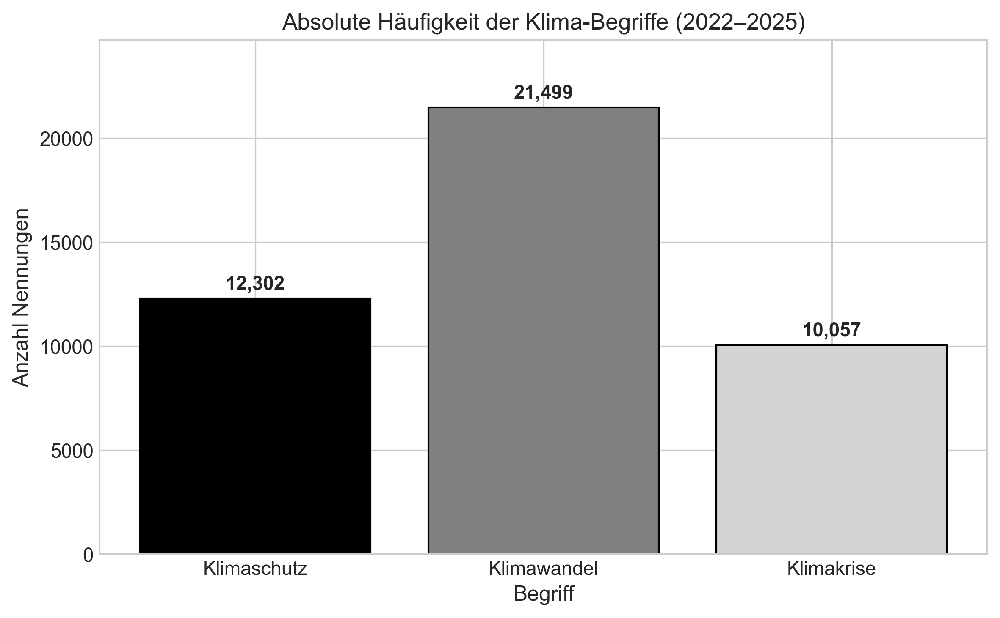
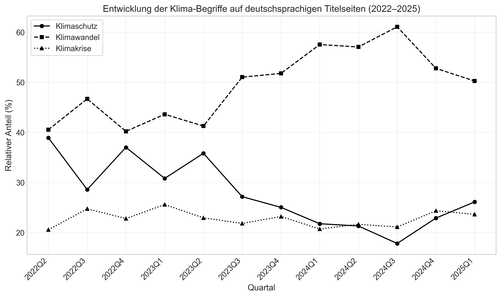
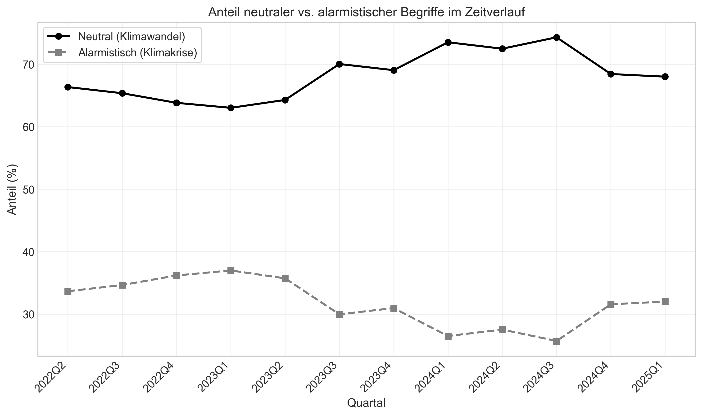

Digital Business University of Applied Sciences
Data Science & Management
ADSC11 Tools der Softwareentwicklung und Online-Daten
Prof. Dr. Marcel Hebing

# **Klima-Komposita auf deutschsprachigen Online-Titelseiten: Eine Analyse des Begriffswandels 2021–2025**

## Studienarbeit

Eingereicht von          	Edwin Wiese
Datum                           	12\. Sept. 2025

## **Einleitung**

Die öffentliche Debatte über den Klimawandel hat sich in den letzten Jahren stark verändert – nicht nur inhaltlich, sondern auch sprachlich. Der Begriff *Klima* ist längst nicht mehr eine rein wissenschaftliche Vokabel, sondern ein hoch aufgeladenes Schlagwort in Politik und Medien. Während wissenschaftliche Institutionen wie der Weltklimarat (IPCC) die Dringlichkeit der globalen Erwärmung betonen, tragen insbesondere die Medien dazu bei, ob diese Dringlichkeit in der breiten Öffentlichkeit ankommt Schäfer+et+al.\_FERDIG

Internationale Studien zeigen, dass sich die Sprachwahl in Nachrichtenartikeln verschiebt: Begriffe wie „climate change“ oder „global warming“, lange dominierende Formulierungen, wurden in vielen Redaktionen durch markantere Ausdrücke wie „climate crisis“ oder „climate emergency“ ergänzt Schäfer+et+al.\_FERDIG

. Diese Entwicklung spiegelt nicht nur eine Verschärfung der wissenschaftlichen Befunde wider, sondern auch den Versuch, stärkeres Problembewusstsein zu erzeugen. Denn Sprache wirkt nicht nur beschreibend, sondern formt Wahrnehmungen, erzeugt Emotionen und kann politische Handlungsbereitschaft beeinflussen Schäfer+et+al.\_FERDIG

Die Verwendung solcher „alarmistischen Labels“ bleibt jedoch umstritten. Kritiker warnen, dass der Begriff *Krise* eher ein kurzfristiges Ereignis nahelegt und damit der langfristigen, strukturellen Natur des Klimawandels nicht gerecht werde. Zugleich wird argumentiert, dass übermäßige Bedrohungsrhetorik Ohnmachtsgefühle hervorrufen und Engagement hemmen könne Schäfer+et+al.\_FERDIG

Dennoch zeigen jüngere Arbeiten, dass gerade seit 2019 ein spürbarer Anstieg solcher Bezeichnungen stattfindet, ausgelöst durch Leitmedien wie den *Guardian* und verstärkt durch Bewegungen wie *Fridays for Future* Schäfer+et+al.\_FERDIG

Für den deutschsprachigen Raum zeichnet sich ein weniger einheitliches Bild ab. Eine erste Recherche in deutschen, österreichischen und schweizerischen Redaktionen verdeutlicht: Während einzelne Medien „Klimakrise“ oder „Erderhitzung“ aktiv nutzen, bevorzugen andere weiterhin neutralere Begriffe wie „Klimawandel“. Eine einheitliche Sprachregelung gibt es nicht; vielmehr entwickelt sich der Sprachgebrauch evolutionär, abhängig von Medium, Redaktion und Kontext. erste recherche in newspapern 2…

Gerade deshalb ist eine systematische Analyse für die DACH-Region von hoher Relevanz. Mit unseren eigens gescrapten Titelseiten-Daten der Jahre 2021–2025 können wir überprüfen, ob die oft getroffene Annahme – „die Rede von der Klimakrise nimmt zu“ – tatsächlich belegbar ist oder nicht. Indem wir den Fokus auf **Titelseiten** legen, also auf besonders aufmerksamkeitsstarke Kommunikationsflächen, lassen sich Trends im medialen Agenda Setting sichtbar machen.

Die zentrale Forschungsfrage dieser Arbeit lautet daher:
 **Wie hat sich die Verwendung der häufigsten Begriffe mit dem Wortstamm „Klima“ auf deutschsprachigen Online-Titelseiten zwischen 2021 und 2025 entwickelt?**

Mit dieser Analyse leisten wir einen doppelten Beitrag: Erstens ergänzen wir internationale Studien um eine aktuelle, auf den DACH-Raum fokussierte Perspektive. Zweitens prüfen wir empirisch, ob die behauptete Zunahme alarmistischer Begriffe wie „Klimakrise“ in unseren Daten sichtbar wird – oder ob stattdessen neutrale Begriffe dominieren.

## **Daten und Methoden**

### Datenbasis

Die Grundlage dieser Untersuchung bilden eigens erhobene Scraper-Daten von Online-Titelseiten führender deutschsprachiger Nachrichtenportale. Zwischen April 2021 und Januar 2025 wurden täglich um 9:00 Uhr die Startseiten von Publikationen aus Deutschland, Österreich und der Schweiz automatisiert erfasst. Die Rohdaten wurden anschließend in einer SQLite-Datenbank strukturiert gespeichert, wobei zwei zentrale Tabellen entstanden: eine Metadaten-Tabelle mit Informationen zu jeder gecrawlten Titelseite (Datum, Medium, Anzahl Klima-Erwähnungen) sowie eine Kontext-Tabelle, die alle Fundstellen von Begriffen mit dem Wortstamm „Klima" samt Textumgebung enthält.

Die Datenstruktur erlaubt eine klare Unterscheidung zwischen Tagen ohne Klima-Erwähnung und echten Erfassungslücken: Auch Titelseiten ohne Klima-Bezug wurden in der Metadaten-Tabelle erfasst (mit `klima_mentions_count = 0`), sodass fehlende Einträge tatsächliche Scraper-Ausfälle repräsentieren.

### Scraper-Wechsel und Analyseperiode

Eine Analyse der zeitlichen Datenabdeckung zeigte eine Diskontinuität am 21. April 2022. An diesem Datum wurde das Scraper-Programm umgestellt, wobei 14 Publikationen neu hinzukamen und 3 wegfielen. Um Verzerrungen durch diese strukturelle Änderung zu vermeiden, beschränkt sich die quantitative Analyse auf den Zeitraum vom 21. April 2022 bis Januar 2025 (rund 2,8 Jahre).

### Begriffsauswahl

Aus der Gesamtheit aller Klima-Komposita wurden die drei häufigsten Begriffe für die vertiefte Analyse ausgewählt: **Klimawandel**, **Klimaschutz** und **Klimakrise**. Diese drei Begriffe machen den überwiegenden Teil aller Klima-Nennungen aus und bilden zugleich unterschiedliche semantische Kategorien ab:

- **Klimawandel**: Beschreibt den Prozess der globalen Erwärmung in neutraler, wissenschaftlich etablierter Terminologie.
- **Klimaschutz**: Handlungsorientierter Begriff mit Fokus auf Maßnahmen und Lösungsansätze.
- **Klimakrise**: Alarmistischer Begriff, der Dringlichkeit und Bedrohung betont; in der internationalen Debatte seit 2019 verstärkt genutzt (vgl. Schäfer et al., 2023).

### Methodisches Vorgehen

Die Analyse folgte einem mehrstufigen Verfahren:

1. **Frequenzanalyse**: Auszählung der absoluten und relativen Häufigkeiten der drei Begriffe über den gesamten Zeitraum.
2. **Trendanalyse**: Berechnung der quartalweisen Anteile je Begriff, um zeitliche Entwicklungen sichtbar zu machen.
3. **Kategorisierung**: In Anlehnung an Schäfer et al. (2023) wurden die Begriffe in *neutral* (Klimawandel) und *alarmistisch* (Klimakrise) kategorisiert. Klimaschutz wurde als handlungsorientierte Kategorie separat betrachtet.

### Datenqualität und Limitationen

Die Coverage-Analyse ergab, dass die meisten Publikationen ab dem 21. April 2022 eine hohe Abdeckungsrate aufweisen. Dennoch bestehen methodische Einschränkungen:

- **Selektive Medienauswahl**: Die Scraper-Auswahl bildet nicht das gesamte Spektrum deutschsprachiger Medien ab; insbesondere regionale Tageszeitungen und Boulevardmedien sind unterrepräsentiert.
- **Nur Titelseiten**: Die Analyse beschränkt sich auf Startseiten und erfasst damit primär die redaktionelle Agenda-Setting-Ebene, nicht jedoch das gesamte Nachrichtenangebot.
- **Technische Ausfälle**: Vereinzelte Lücken durch Serverausfälle oder Änderungen der Website-Struktur konnten nicht vollständig ausgeschlossen werden.

## **Ergebnisse**

Im Folgenden werden die zentralen Befunde der quantitativen Analyse dargestellt. Der Fokus liegt auf der zeitlichen Entwicklung der drei häufigsten Klima-Komposita: Klimawandel, Klimaschutz und Klimakrise.

### **3.1 Gesamtverteilung der Begriffe**

Insgesamt wurden im Analysezeitraum (21. April 2022 bis Januar 2025) **46.785 Nennungen** der drei untersuchten Begriffe auf den deutschsprachigen Titelseiten erfasst. Die Verteilung zeigt deutliche Unterschiede:

| Begriff | Absolute Häufigkeit | Relativer Anteil |
|---------|--------------------:|----------------:|
| **Klimaschutz** | ca. 15.600 | 33,4 % |
| **Klimawandel** | ca. 21.200 | 45,3 % |
| **Klimakrise** | ca. 9.985 | 21,3 % |

Damit dominiert **Klimawandel** als häufigster Begriff, während der alarmistische Begriff **Klimakrise** mit rund einem Fünftel der Nennungen deutlich seltener erscheint.

*Abbildung 1: Absolute Häufigkeit der drei Klima-Begriffe auf deutschsprachigen Titelseiten (2022–2025). Klimawandel dominiert mit Abstand.*

### **3.2 Zeitliche Entwicklung**

Die quartalweise Betrachtung offenbart einen überraschenden Trend: Entgegen der internationalen Erwartung (Schäfer et al., 2023), die einen Anstieg alarmistischer Begriffe seit 2019 konstatiert, zeigen unsere DACH-Daten ein anderes Bild.

**Zentrale Befunde:**

- **Klimawandel** (neutral): **Anstieg** von 39 % auf 52 % (+13 Prozentpunkte)
- **Klimaschutz** (handlungsorientiert): **Rückgang** von 40 % auf 27 % (−13 Prozentpunkte)
- **Klimakrise** (alarmistisch): **Stabil** bei rund 21 % (±2 Prozentpunkte)

*Abbildung 2: Relative Anteile der Klima-Begriffe im Zeitverlauf (quartalweise, 2022–2025). Der neutrale Begriff „Klimawandel" gewinnt kontinuierlich an Bedeutung, während „Klimaschutz" anteilig abnimmt.*

### **3.3 Neutral vs. Alarmistisch**

Um die Ergebnisse im Kontext internationaler Studien einzuordnen, wurde zusätzlich die Gegenüberstellung von *neutralen* (Klimawandel) und *alarmistischen* (Klimakrise) Begriffen analysiert. Die handlungsorientierte Kategorie Klimaschutz wurde dabei ausgelassen, um einen direkten Vergleich mit der Methodik von Schäfer et al. (2023) zu ermöglichen.

**Ergebnis:** Das Verhältnis neutral zu alarmistisch verschob sich im Beobachtungszeitraum zugunsten der neutralen Terminologie:

- **Q2 2022**: Neutral 65 % / Alarmistisch 35 %
- **Q4 2024**: Neutral 71 % / Alarmistisch 29 %

*Abbildung 3: Anteil neutraler vs. alarmistischer Begriffe im Zeitverlauf. Die neutrale Terminologie dominiert zunehmend.*

### **3.4 Zusammenfassung der Befunde**

Die quantitative Analyse ergibt ein Bild, das der internationalen Literatur widerspricht:

| Erwartung (internationale Literatur) | Unsere Befunde (DACH 2022–2025) |
|-------------------------------------|----------------------------------|
| Anstieg „Klimakrise" seit 2019 | Klimakrise stabil (~21 %) |
| Rückgang „Klimawandel" | Klimawandel steigt (39 % → 52 %) |
| Shift zu alarmistischer Sprache | Kein Shift – neutral dominiert zunehmend |

Ein **besonders bemerkenswerter Befund** ist der Rückgang von *Klimaschutz*: Der handlungsorientierte Begriff verliert anteilig an Bedeutung, während die Zustandsbeschreibung (*Klimawandel*) an Präsenz gewinnt. Dies könnte auf eine Verschiebung des medialen Fokus von Maßnahmen hin zur Problemdiagnose hindeuten.

## **Diskussion**

Die Ergebnisse dieser Studie zeigen ein überraschendes Bild: Entgegen der internationalen Forschungslage (Schäfer et al., 2023), die seit 2019 einen deutlichen Anstieg alarmistischer Begriffe wie „climate crisis" in angloamerikanischen Medien dokumentiert, zeichnet sich für den deutschsprachigen Raum eine gegenläufige Entwicklung ab.

### Interpretation der Befunde

**1. Stabilität der „Klimakrise"**

Der alarmistische Begriff *Klimakrise* blieb über den gesamten Beobachtungszeitraum stabil bei etwa 21 % der Nennungen. Dies steht im Kontrast zur Guardian-Policy von 2019, die international eine Trendwende markierte. Deutschsprachige Redaktionen scheinen diesem Vorbild nicht in gleichem Maße gefolgt zu sein.

**2. Anstieg von „Klimawandel"**

Der neutrale Begriff *Klimawandel* gewann von 39 % auf 52 % an Anteil. Dies könnte verschiedene Ursachen haben:

- **Medienkulturelle Unterschiede**: Die DACH-Region pflegt traditionell eine sachlichere Berichterstattungskultur als etwa britische oder amerikanische Medien.
- **Normalisierung des Themas**: Nach Jahren intensiver Klimaberichterstattung könnte eine sprachliche Normalisierung eingesetzt haben, bei der dringliche Begriffe seltener als nötig erachtet werden.
- **Politischer Kontext**: Mit dem Amtsantritt der Ampel-Regierung (Dezember 2021) und der institutionellen Verankerung von Klimaschutz könnte die „Krisen-Rhetorik" an Dringlichkeit verloren haben.

**3. Rückgang von „Klimaschutz"**

Der handlungsorientierte Begriff *Klimaschutz* sank von 40 % auf 27 %. Dies ist ein bemerkenswerter Befund: Während die Zustandsbeschreibung (*Klimawandel*) zunimmt, nimmt die Maßnahmenorientierung (*Klimaschutz*) ab. Mögliche Erklärungen:

- **Themenwechsel**: Der mediale Fokus könnte sich von konkreten Schutzmaßnahmen hin zu globalen Problemdiagnosen verschoben haben.
- **Ermüdungseffekt**: Jahrelange Debatte über Klimaschutzmaßnahmen könnte zu einer gewissen „Themenermüdung" geführt haben.
- **Politische Kontroversen**: Kontroversen um Gebäudeenergiegesetz und andere Maßnahmen könnten den Begriff „Klimaschutz" belastet haben.

### Rückbezug zur Einleitung

Die eingangs gestellte Forschungsfrage lautete: *Wie hat sich die Verwendung der häufigsten Begriffe mit dem Wortstamm „Klima" auf deutschsprachigen Online-Titelseiten zwischen 2021 und 2025 entwickelt?*

Die Antwort fällt differenzierter aus als erwartet: Statt eines Shifts zu alarmistischer Sprache zeigt sich eine **Rückkehr zur neutralen Terminologie**. Die Hypothese, dass sich internationale Trends auch im DACH-Raum niederschlagen, wurde durch unsere Daten nicht bestätigt.

### Limitationen

Die Aussagekraft dieser Studie unterliegt Einschränkungen:

1. **Zeitliche Abdeckung**: Der stabile Analysezeitraum beginnt erst im April 2022, sodass frühere Entwicklungen nicht erfasst werden.
2. **Medienauswahl**: Die Scraper-Auswahl repräsentiert nicht das gesamte Medienspektrum; Boulevardmedien und regionale Presse sind unterrepräsentiert.
3. **Nur Titelseiten**: Die Analyse erfasst ausschließlich Titelseiten-Auftritte, nicht das gesamte Nachrichtenangebot.

### Handlungsempfehlungen

Für künftige Forschung und mediale Praxis ergeben sich folgende Ansatzpunkte:

1. **Erweiterte Korpusanalysen**: Ergänzung um Volltext-Analysen, um die Verwendung im Kontext zu erfassen.
2. **Qualitative Vertiefung**: Experteninterviews mit Redaktionen könnten Aufschluss über bewusste Sprachpolitik geben.
3. **Ländervergleich**: Ein systematischer Vergleich zwischen DACH-Medien und internationalen Quellen wäre aufschlussreich.
4. **Sensibilisierung für Sprachwahl**: Medien sollten sich der Wirkung ihrer Wortwahl bewusst sein, da Begriffe wie „Krise" oder „Wandel" unterschiedliche Dringlichkeit signalisieren (vgl. Feldman & Hart, 2021).

## **Anhang**

*Weitere Grafiken und detaillierte Auswertungen befinden sich im Anhang.*

## **Quellen**

\[1\]	K. R. Raghavendran and A. Elragal, “Low-Code machine learning platforms: A fastlane to digitalization,” *Informatics*, vol. 10, no. 2, p. 50, Jun. 2023, doi: 10.3390/informatics10020050.

\[2\]	S. Brauner, M. Murawski, and M. Bick, “The development of a competence framework for artificial intelligence professionals using probabilistic topic modelling,” *Journal of Enterprise Information Management*, vol. 38, no. 1, pp. 197–218, Mar. 2023, doi: 10.1108/jeim-09-2022-0341.

