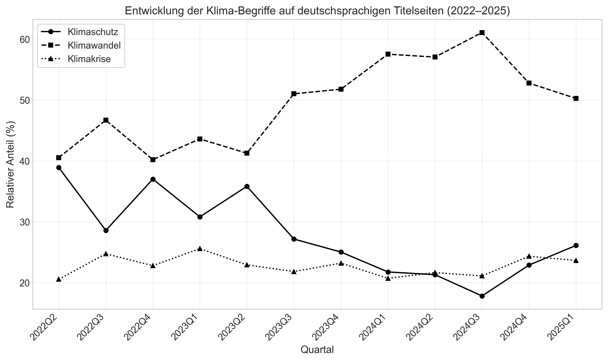
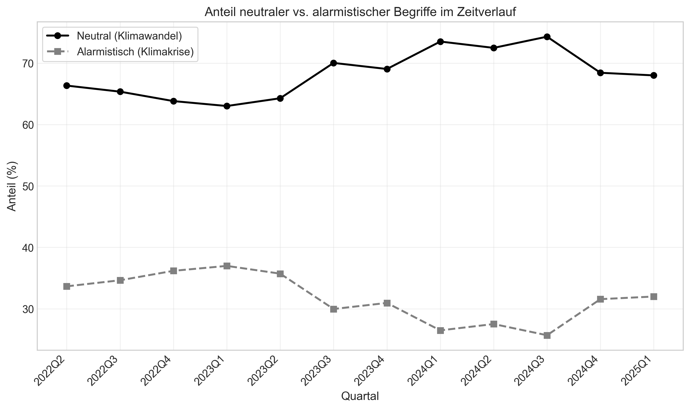

Digital Business University of Applied Sciences
Data Science & Management
ADSC11 Tools der Softwareentwicklung und Online-Daten
Prof. Dr. Marcel Hebing

# **Klima-Komposita auf deutschsprachigen Online-Titelseiten: Eine Analyse des Begriffswandels 2021–2025**

## Studienarbeit

Eingereicht von          	Edwin Wiese
Datum                           	12. Sept. 2025

## 1. Einleitung

Die öffentliche Klimadebatte wird nicht nur über Daten und Ereignisse geführt, sondern auch über Begriffe. Ob Medien eher von Klimawandel, Klimaschutz oder Klimakrise sprechen, beeinflusst die Wahrnehmung von Dringlichkeit, Verantwortlichkeit und Handlungsbedarf. Für die gesellschaftliche Einordnung der Klimakrise sind diese sprachlichen Unterschiede relevant, weil sie als Teil journalistischer Agenda- und Framebildung wirken (Entman, 1993; McHugh et al., 2021). Die wissenschaftliche Dringlichkeit ist zugleich gut belegt, etwa durch den AR6-Synthesebericht des IPCC (IPCC, 2023).

Internationale Befunde zeigen eine Verschiebung der Klima-Terminologie seit 2019. In einer groß angelegten automatisierten Inhaltsanalyse mit 89.887 Artikeln aus acht Ländern dokumentieren Schäfer et al. (2023), dass alarmistische Labels wie climate crisis oder climate emergency zugenommen haben, während neutrale Begriffe insgesamt weiter dominieren. Parallel dazu änderten einzelne Leitmedien ihre Sprachrichtlinien, etwa der Guardian im Jahr 2019. Dieser Schritt gilt als wichtiger Mitfaktor der Debatte, aber nicht als alleinige Ursache der internationalen Entwicklung (Carrington, 2019; Schäfer et al., 2023).

Gleichzeitig ist die Wirkung alarmistischer Begriffe umstritten. Experimentelle Evidenz zeigt, dass emergency-Formulierungen die wahrgenommene Glaubwürdigkeit von Beiträgen senken können, ohne das Klima-Engagement systematisch zu erhöhen (Feldman & Hart, 2021). Für Governance und Politik lassen sich ebenfalls keine einfachen linearen Effekte ableiten, sondern je nach Kontext unterschiedliche Reaktionspfade (McHugh et al., 2021). Damit entsteht eine Spannungsfrage zwischen sprachlicher Dringlichkeit und kommunikativer Anschlussfähigkeit.

Für den deutschsprachigen Raum besteht hierzu weiterhin eine Lücke. Es liegen zwar internationale und theoretische Arbeiten vor, aber nur wenige direkte Zeitreihenbefunde zur Verwendung zentraler Klima-Begriffe auf deutschsprachigen Online-Titelseiten im Zeitraum 2021 bis 2025. Genau hier setzt diese Arbeit an.

Die zentrale Forschungsfrage lautet:

**Wie hat sich die Verwendung der häufigsten Begriffe mit dem Wortstamm Klima auf deutschsprachigen Online-Titelseiten zwischen 2021 und 2025 entwickelt?**

Der Beitrag der Arbeit ist zweifach. Erstens liefert sie eine DACH-spezifische Anschlussanalyse zu internationalen Studien. Zweitens vergleicht sie neutral-deskriptive, handlungsorientierte und alarmistische Begriffe auf einer einheitlichen Datengrundlage und macht damit die Richtung des medialen Begriffswandels transparent.

## 2. Daten und Methoden

### 2.1 Datenbasis

Die empirische Grundlage bilden eigene Scraper-Daten aus deutschsprachigen Online-Medien. Zwischen April 2021 und Januar 2025 wurden täglich um 09:00 Uhr Titelseiten automatisiert erfasst und in einer SQLite-basierten Datenstruktur gespeichert. Insgesamt umfasst das Rohpanel 47 Medienquellen. Für die Analyse wurden zwei Ebenen genutzt:

1. Metadaten je Crawl-Einheit, einschließlich Datum, Quelle und Klima-Nennungen.
2. Kontextdaten mit den gefundenen Klima-Komposita und Textumgebung.

Diese Trennung erlaubt eine methodisch wichtige Unterscheidung zwischen echten Nullbeobachtungen und Erhebungslücken. Tage mit klima_mentions_count = 0 sind beobachtete Nullwerte, fehlende Einträge dagegen potenzielle technische Ausfälle.

### 2.2 Analysezeitraum und struktureller Bruch

Die Coverage-Prüfung zeigt einen strukturellen Einschnitt am 21.04.2022 durch eine Änderung der Scraper-Architektur und des Quellenpanels. Um verzerrte Vorher-Nachher-Vergleiche zu vermeiden, basiert die quantitative Hauptauswertung auf dem stabileren Zeitraum vom 21.04.2022 bis 31.01.2025. Dieser Zeitraum umfasst 1.017 Kalendertage. Für diesen Zeitraum liegen Daten von 45 Medienquellen vor.

### 2.3 Begriffsauswahl und Kategorisierung

Analysiert werden die drei häufigsten Klima-Komposita der Datenbasis:

- Klimawandel als neutral-deskriptiver Begriff
- Klimaschutz als handlungsorientierter Begriff
- Klimakrise als alarmistischer Begriff

Die Kategorisierung folgt der internationalen Terminologie-Debatte in der Klimakommunikationsforschung (Schäfer et al., 2023; Haueis, 2024) und wird durch lexikalische Abgrenzungen gestützt (Duden, 2025a, 2025b, 2025c).

Operationalisierung: Aus den Kontextdaten wurden alle Fundstellen extrahiert, die den Wortstamm Klima enthalten. Für die Hauptanalyse wurden anschließend alle Treffer den drei Zielbegriffen Klimawandel, Klimaschutz und Klimakrise zugeordnet. Gezählt wurden Vorkommen der Begriffe auf Basis der erfassten Kontexttreffer. Die Auswertung ist deskriptiv und enthält keine inferenzstatistischen Signifikanztests.

### 2.4 Auswertungsschritte

Die Auswertung umfasst drei Schritte:

1. Absolute Häufigkeiten der drei Begriffe über den Gesamtzeitraum.
2. Quartalsweise relative Anteile zur Trendbeobachtung.
3. Vergleich neutral-deskriptiv vs. alarmistisch als reduziertes Zwei-Kategorien-Setting (Klimawandel vs. Klimakrise), angelehnt an internationale Vergleichslogik.

Wichtiger Hinweis zum Nenner: Relative Anteile in Kapitel 3 beziehen sich auf die Summe der drei Zielbegriffe (Top-3-Set) und nicht auf alle im Korpus vorkommenden Klima-Komposita.

### 2.5 Datenqualität und Grenzen

Die Aussagekraft der Analyse wird durch folgende Punkte begrenzt:

- Selektion der Quellen: Das Panel bildet nicht das gesamte deutschsprachige Mediensystem ab.
- Fokus auf Titelseiten: Keine Volltextanalyse der Artikelkörper.
- Technische Unsicherheit: Einzelne Ausfälle durch Website-Änderungen sind nicht vollständig vermeidbar.
- Vergleichbarkeit: Der internationale Literaturvergleich ist inhaltlich, aber nicht vollständig methodengleich.
- Statistische Unsicherheit: Es wurden keine Konfidenzintervalle oder formalen Trendtests berechnet.

## 3. Ergebnisse

### 3.1 Gesamtverteilung

Im Analysezeitraum (21.04.2022 bis 31.01.2025) wurden insgesamt 46.785 Nennungen der drei Zielbegriffe gezählt.

| Begriff | Absolute Häufigkeit | Relativer Anteil |
|---------|--------------------:|----------------:|
| Klimawandel | 21.542 | 46,04 % |
| Klimaschutz | 14.663 | 31,34 % |
| Klimakrise | 10.580 | 22,61 % |

Der am häufigsten verwendete Begriff ist Klimawandel. Klimakrise bleibt mit gut einem Fünftel der Nennungen deutlich dahinter.

### 3.2 Zeitliche Entwicklung der drei Begriffe

Die quartalsweise Entwicklung im Top-3-Set zeigt folgende Trends:

- Klimawandel steigt von rund 39 % auf 52 %.
- Klimaschutz sinkt von rund 40 % auf 27 %.
- Klimakrise bleibt mit etwa 21 % weitgehend stabil.

*Abbildung 1: Quartalsweise relative Anteile der drei häufigsten Klima-Komposita (2022-2025).*

### 3.3 Neutral-deskriptiv versus alarmistisch

Für den direkten Anschluss an die internationale Diskussion wurde zusätzlich das Verhältnis von Klimawandel (neutral-deskriptiv) zu Klimakrise (alarmistisch) betrachtet. Im Vergleich dieser beiden Begriffe verschiebt sich der Anteil zugunsten neutral-deskriptiver Bezeichnungen:

- Erstes Quartal im Analysefenster: 65,0 % neutral-deskriptiv, 35,0 % alarmistisch
- Letztes Quartal im Analysefenster: 71,4 % neutral-deskriptiv, 28,6 % alarmistisch

*Abbildung 2: Entwicklung der Anteile neutral-deskriptiver und alarmistischer Begriffe im Zeitverlauf.*

### 3.4 Kernergebnis

Die Daten zeigen im Beobachtungszeitraum keinen ausgeprägten Aufwärtstrend für den alarmistischen Kernbegriff Klimakrise. Gleichzeitig nimmt der Anteil des neutral-deskriptiven Begriffs Klimawandel innerhalb des Top-3-Sets zu. Für den untersuchten DACH-Ausschnitt ist dies vereinbar mit einer relativen Stabilität alarmistischer Sprache bei gleichzeitiger Neuorientierung hin zu neutral-deskriptiver Terminologie.

## 4. Diskussion

### 4.1 Einordnung im Literaturkontext

Die Befunde ergänzen internationale Studien durch eine regionale Perspektive. Schäfer et al. (2023) beschreiben international einen starken Zuwachs alarmistischer Labels seit 2019. In den hier untersuchten deutschsprachigen Titelseiten von 2022 bis 2025 zeigt sich dagegen keine Fortsetzung dieses Musters. Diese Abweichung bedeutet keinen Widerspruch im strengen Sinn, sondern verweist auf unterschiedliche Untersuchungsfenster, Samples und nationale Medienlogiken (Lück et al., 2018).

### 4.2 Interpretation der drei Trends

Erstens bleibt Klimakrise im Zeitverlauf weitgehend stabil. Das liefert im untersuchten Zeitraum keinen Hinweis auf eine fortlaufende Eskalation der Krisenrhetorik.

Zweitens steigt Klimawandel deutlich. Das kann auf sprachliche Normalisierung, redaktionelle Standardisierung oder strategische Anschlussfähigkeit an ein breiteres Publikum hindeuten. Eine plausible, aber hier nicht getestete Erklärung ist eine stärkere Orientierung an anschlussfähigen Standardbegriffen.

Drittens sinkt Klimaschutz relativ stark. Das deutet auf eine Verschiebung von lösungsbezogenen Begriffen zu problembeschreibenden Begriffen hin. Diese Entwicklung ist relevant, weil Kommunikationsforschung zeigt, dass Frame-Wirkungen je nach Problem- versus Handlungsfokus unterschiedlich ausfallen können (Feldman & Hart, 2021; Stoknes, 2014).

### 4.3 Was sich aus den Daten sagen lässt und was nicht

Die Arbeit erlaubt robuste deskriptive Aussagen zur Begriffsverteilung auf Titelseiten im untersuchten Panel. Sie erlaubt keine kausalen Aussagen darüber, warum Redaktionen bestimmte Begriffe wählen. Aussagen wie Der Guardian war der alleinige Auslöser globaler Sprachverschiebungen wären daher zu stark. Plausibler ist eine Kombination aus redaktionellen Richtlinien, politischen Ereignissen und länderspezifischen Öffentlichkeiten (Carrington, 2019; McHugh et al., 2021).

### 4.4 Handlungsempfehlungen

1. Erweiterung auf Volltextdaten, um Titelseiten- und Artikelsprachgebrauch systematisch zu vergleichen.
2. Ergänzung um quellen-spezifische Zeitreihen, um Unterschiede zwischen Medientypen sichtbar zu machen.
3. Kombination mit qualitativer Redaktionsforschung, um Begriffsentscheidungen nachvollziehen zu können.
4. Anschlussanalyse für 2025+, um zu prüfen, ob Stabilität von Klimakrise anhält oder kippt.

## Anhang

Zusätzliche Grafiken und Detailtabellen werden im Anhang dokumentiert, darunter die reine absolute Häufigkeitsgrafik als Ergänzung zur Ergebnisdarstellung.

## Quellenverzeichnis

Carrington, D. (2019, 17. Mai). Why the Guardian is changing the language it uses about the environment. The Guardian. https://www.theguardian.com/environment/2019/may/17/why-the-guardian-is-changing-the-language-it-uses-about-the-environment

Duden. (2025a). Klimawandel. https://www.duden.de/rechtschreibung/Klimawandel

Duden. (2025b). Klimakrise. https://www.duden.de/rechtschreibung/Klimakrise

Duden. (2025c). Klimaschutz. https://www.duden.de/rechtschreibung/Klimaschutz

Entman, R. M. (1993). Framing: Toward clarification of a fractured paradigm. Journal of Communication, 43(4), 51-58. https://doi.org/10.1111/j.1460-2466.1993.tb01304.x

Feldman, L. A., & Hart, P. S. (2021). Upping the ante? The effects of emergency and crisis framing in climate change news. Climatic Change, 169, 31. https://doi.org/10.1007/s10584-021-03219-5

Haueis, P. (2024). Climate concepts for supporting political goals of mitigation and adaptation: The case for climate crisis. WIREs Climate Change, 15(5), e893. https://doi.org/10.1002/wcc.893

IPCC. (2023). AR6 synthesis report: Climate change 2023. https://www.ipcc.ch/2023/03/20/press-release-ar6-synthesis-report/

Lück, J., Wozniak, A., & Wessler, H. (2018). Counterbalancing global media frames with nationally colored narratives: A comparative study of news narratives and news framing in the climate change coverage of five countries. Journalism, 19(12), 1635-1656. https://doi.org/10.1177/1464884916680372

McHugh, L. H., Lemos, M. C., & Morrison, T. H. (2021). Risk? Crisis? Emergency? Implications of the new climate emergency framing for governance and policy. WIREs Climate Change, 12(6), e736. https://doi.org/10.1002/wcc.736

Schäfer, M. S., Hase, V., Mahl, D., & Krayss, X. (2023). From climate change to climate crisis? Bergen Language and Linguistics Studies, 13(1), 161-183. https://doi.org/10.15845/bells.v13i1.3980

Stoknes, P. E. (2014). Rethinking climate communications and the climate crisis: A public health perspective. Energy Research & Social Science, 1, 161-170. https://doi.org/10.1016/j.erss.2014.03.007

