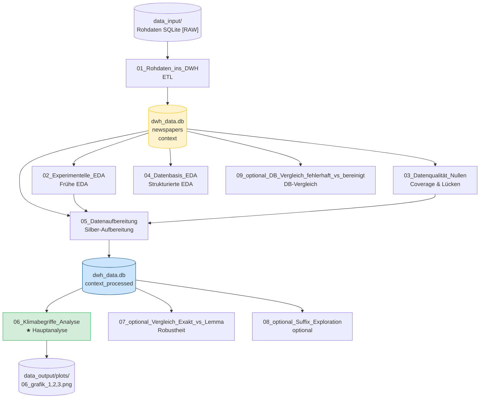

# Datenmodell – ER-Diagramm

## Datenbankschema (dwh_data.db)

Drei persistente Tabellen in einer SQLite-Datenbank (Bronze + Silver):

**Natürlicher Schlüssel** in `newspapers`: `(newspaper_name, data_published)` — idempotenter Import verhindert Duplikate bei Wiederholungsläufen.

**Datenvolumen** (Stand: 31.01.2025):
- `newspapers`: 58.775 Zeilen (Zeitung × Tag)
- `context`: 172.610 Zeilen (je eine Klima-Nennung)
- `context_processed`: 172.610 Zeilen (+ `suffix_lemma`-Spalte aus NB 05)

---

## Notebook-Pipeline (Ausführungsreihenfolge)

**Legende:**
- 🟡 Bronze: Rohdaten-Ingest
- 🔵 Silver: Normalisierte Analysebasis
- 🟢 Hauptanalyse (NB 06) → Ergebnisse der Studienarbeit
