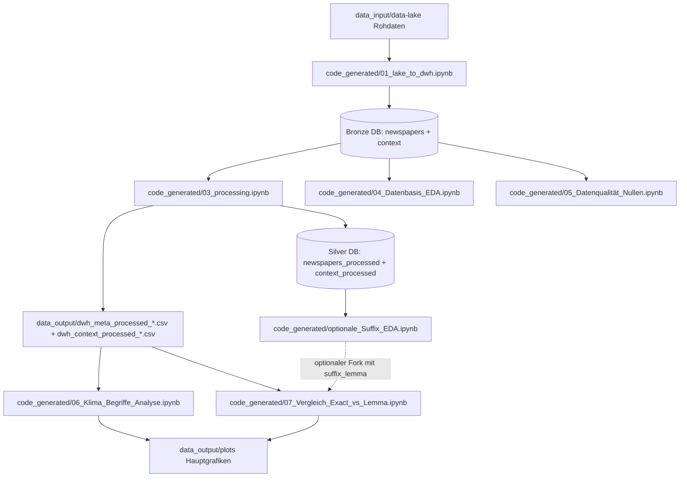
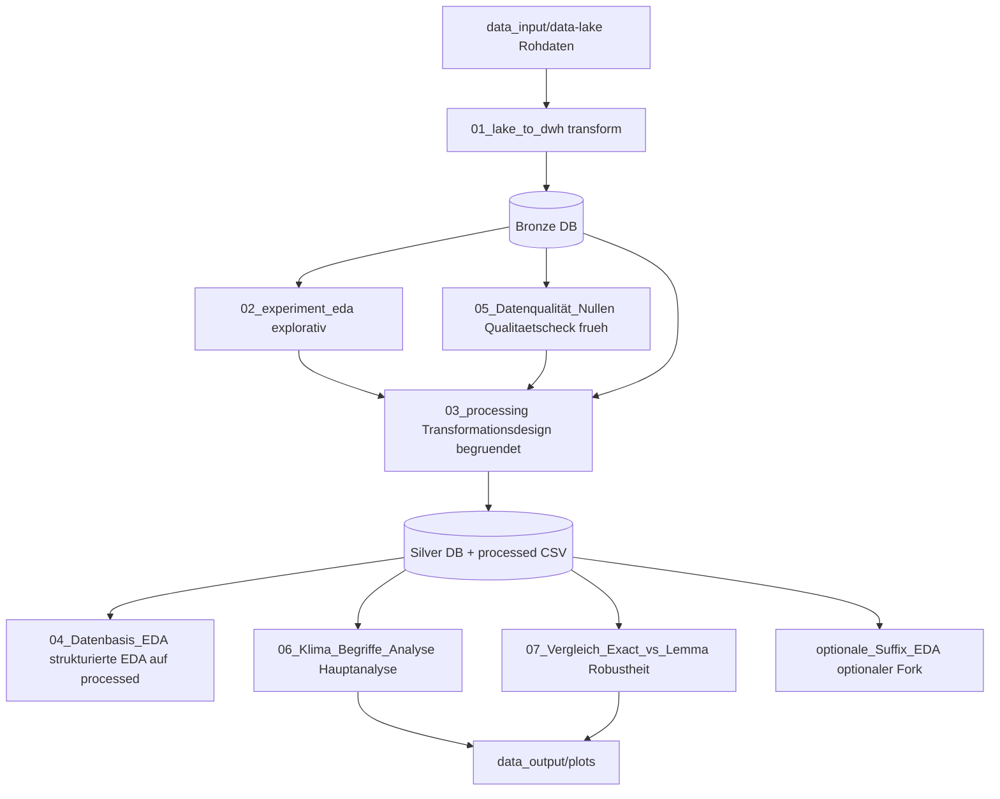

# manage_todo_list (19.03.2026)
- add to project serm / mermaid diagramm.
- document data follwing the non_code/railguard_docs.md
- add small Pytest maybe for the functions that get used / referenced in the notebooks as a little add to get extra points (just little tests hwoing the function workds as intended, like grouping with null without null or whatever makes sense, data output reflects wanted output with small test data set or similar).

fasse gern den letzten chat "Zotero Sammlung und Artikelüberprüfung für Forschung" zusammen und lese diese um zu verstehen, warum es geht. wir hatten dort nicht den code subagent genutzt und daher leider kein python notebook (wie in den agent vorgaben erklärt) erstellt. das ist nicht gut.
du wirst jetzt also das python script der robustheit als jupyternotebook wie die anderen mit kommentaren und durchgehen lauffähig (clear, run) umschreiben lassen vom code agent. es sollte wie die anderen notebooks aufgebaut sein. wenn nötig methoden aus den pylib verwenden, und nicht neu schreiben, wenn es die gleichen sind (nicht alte pylib methoden anpassen, die nutzen wir ja bereits in anderen scripten). es kann auch auf den stand eines anderen notebooks aufbauen, denn es sollten wiederholungen vermieden werden.

finde einen geeignetn platz für die ausgabe in zellen der top suffix lemma je begriff. ich denke es gehört fachlich in klima begriff analyse.

außreiser am ende der datenerhebung, fehler in der datenaufbereitung oder bereits im scraping? kann eigentlich nicht sein, sollten ursache definieren.

notebooks und coder haben daten von notebook/ statt code_generated geladen, wie z.b. dwh_context_processed_... das sollte so nicht sein. wir wollen notebook/später löschen. alle notebooks sollten in code_generated für sich allein stehen können (inklusive pylib, aber bene ohne notebook/ dir). auch sollten plots die gespeichert werden, in data_output/plots gelegt werden. Prüfe, ob der code agent das berücksichtigt und lass ihn die notebooks anpassen. mhm, ich sehe, dass sogar unser generated 01 notebook, auf denen in notebook aufbaut, wir sollten diese also in code_generated verschieben? baue mal ein serm / mermaid diagramm und die reihenfolge der notebooks prüfen, ich glaube der aktuele stand ist:
1 notebooks/01_lake_to_dwh.ipynb
notebooks/02_experiment_eda.ipynb
notebooks/03_processing.ipynb
code_generated/01_Datenbasis_EDA.ipynb
code_generated/draft_Suffix_Analyse_Neutral.ipynb
code_generated/02_Datenqualität_Nullen.ipynb
code_generated/03_Klima_Begriffe_Analyse.ipynb
code_generated/06_Vergleich_Exact_vs_Lemma.ipynb

schlage vor, wie wir das aufräumen. beachte dabei unsere studienarbeit non_code/01_ADS Studienarbeit.md !

## Notebook-Stammbaum mit aktuellen Dateinamen (20.03.2026)

### Kurzantwort auf die offene Frage
- Die Null-Analyse startet auf dem Bronze-Stand direkt nach code_generated/01_lake_to_dwh.ipynb.
- Konkret liest code_generated/05_Datenqualität_Nullen.ipynb die Tabellen newspapers und context aus data_output/dwh_data.db.
- Sie setzt nicht erst auf context_processed/newspapers_processed auf.

### Stages
- Stage Bronze: Rohdaten ingest nach data_output/dwh_data.db (newspapers, context).
- Stage Silver: Verarbeitung/Normalisierung nach data_output/dwh_data.db (newspapers_processed, context_processed) plus processed CSV.
- Stage Gold: finale Arbeits-Grafiken und Robustheitscheck aus processed Daten.

### Hauptstamm mit Abzweigen

### I/O je Notebook (vereinfacht)
| Notebook | Input | Output | Rolle |
|---|---|---|---|
| code_generated/01_lake_to_dwh.ipynb | data_input/data-lake | dwh_data.db: newspapers/context, dwh_meta_*.csv, dwh_context_*.csv | Transform (Bronze) |
| code_generated/03_processing.ipynb | dwh_data.db: newspapers/context | dwh_data.db: newspapers_processed/context_processed, dwh_*_processed_*.csv | Transform (Silver) |
| code_generated/04_Datenbasis_EDA.ipynb | dwh_data.db: newspapers/context | Notebook-Auswertung | Analyse (Bronze-Branch) |
| code_generated/05_Datenqualität_Nullen.ipynb | dwh_data.db: newspapers/context | Notebook-Auswertung | Analyse (Bronze-Branch, Nullen) |
| code_generated/06_Klima_Begriffe_Analyse.ipynb | dwh_*_processed_*.csv | data_output/plots/grafik_*.png | Analyse (Gold, Hauptteil) |
| code_generated/07_Vergleich_Exact_vs_Lemma.ipynb | dwh_*_processed_*.csv | data_output/plots/06_*.png | Analyse (Gold, Robustheit) |
| code_generated/optionale_Suffix_EDA.ipynb | context_processed/newspapers_processed | optionale EDA-Auswertung | Analyse (optionaler Silver-Fork) |

### Einordnung suffix_lemma
- Ja, deine Einordnung ist stimmig.
- suffix_lemma ist ein methodischer Fork aus Silver fuer optionale oder robuste Zusatzanalysen.
- Die finale Begriffsanalyse fuer die Arbeit kann trotzdem auf festen Zielbegriffen laufen.

## Korrektur und Klarstellung zur Reihenfolge (20.03.2026)

### Kernpunkt
- Ja: Wir sollten dwh_data.db nicht still ueberschreiben, wenn wir Stage-Ergebnisse trennen wollen.
- Ja: 02_experiment_eda muss als expliziter Zwischenschritt sichtbar sein.
- Ja: Nullen-Analyse gehoert nach vorne, weil sie die Datenqualitaet der Bronze-Basis belegt.

### Warum 02_experiment_eda wichtig ist
- Ohne 02_experiment_eda waere nicht transparent, wie Hypothesen fuer processing entstanden sind.
- 02_experiment_eda liefert die explorativen Hinweise fuer:
    - Cutoff-Entscheidung
    - Datenqualitaetsfragen
    - Normalisierungsbedarf vor/samt processing

### Vorschlag Artefakte ohne Ueberschreiben
- Bronze DB: data_output/dwh_bronze.db
- Silver DB: data_output/dwh_silver.db
- Gold Artefakte: data_output/plots + Reporting-Tabellen/CSV
- Raw Snapshot CSV: dwh_meta_*.csv, dwh_context_*.csv (Bronze)
- Processed Snapshot CSV: dwh_meta_processed_*.csv, dwh_context_processed_*.csv (Silver)

Hinweis:
- Bestehende dwh_data.db bleibt als historischer Stand erhalten oder wird als Alias fuer Bronze dokumentiert.

### Reihenfolge mit Hauptstamm und Frueh-EDA
1. code_generated/01_lake_to_dwh.ipynb
2. code_generated/02_experiment_eda.ipynb
3. code_generated/05_Datenqualität_Nullen.ipynb
4. code_generated/03_processing.ipynb
5. code_generated/04_Datenbasis_EDA.ipynb
6. code_generated/06_Klima_Begriffe_Analyse.ipynb
7. code_generated/07_Vergleich_Exact_vs_Lemma.ipynb
8. code_generated/optionale_Suffix_EDA.ipynb (optional)

### Stammbaum (klarer Hauptstamm)

### Offene Entscheidung fuer Code-Agent
- Soll 03_processing direkt auf dwh_bronze.db lesen und nach dwh_silver.db schreiben?
- Oder sollen wir beim einen DB-Namen bleiben und nur Tabellenstufen trennen?

